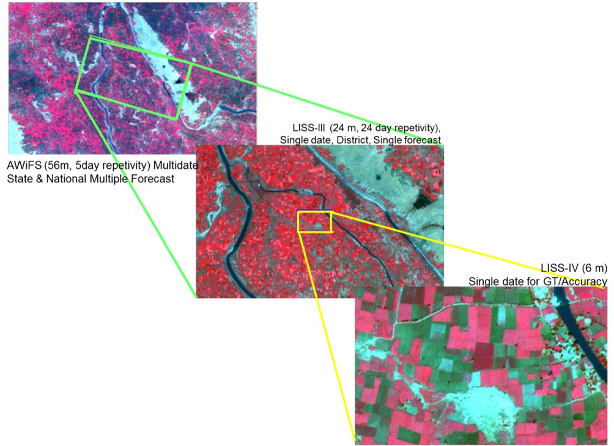
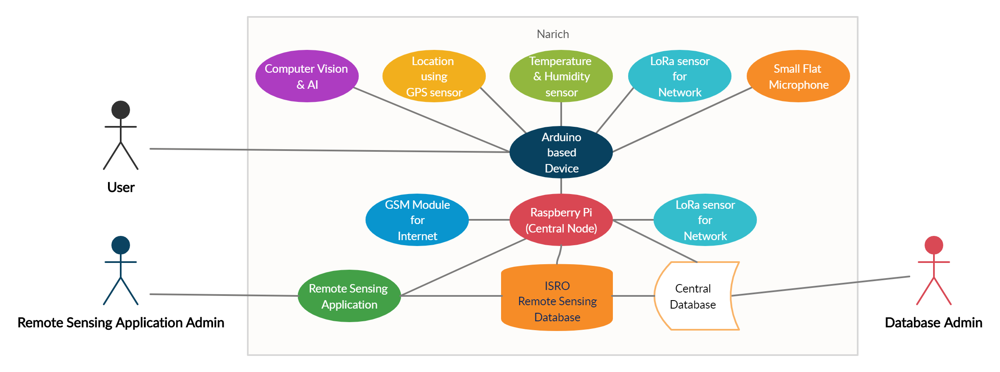

# Narich

<image src="images/logo.png" height=75 width=175/>

Narich is a Raw Jute Assessment device for India which was developed by **Team Cyber Flux** based on a problem statement given by **National Jute Board, Ministry of Textiles** in **SIH 2020 - Hardware Edition**. 

**Problem Statement Number:** AR249

**Problem Statement Title:** Scientific way of assessing the quality parameters of raw jute produced/sold by farmers by linking with raw jute crop assessment through remote sensing application of NASA/ISRO.

**Organization:** National Jute Board, Ministry of Textiles

## Project Description

Narich helps in assessing the quality parameters of the raw jute by measuring and assessing:

* Texture quality of the raw jute using Small Flat Microphone with FFT Analysis & Deep Learning.
* Health, height, width & colour of the crop, determined using Computer Vision & Artificial Intelligence.
* Location where the crop is cultivated using GPS and Remote Sensing.
* Temperature & Humidity for cultivation of jute using DHT22 sensor.
* Annual & Seasonal rainfall based analysis for assessment of raw jute using historical data.

The above mentioned parameters can be assessed in real-time using Arduino based device integrated with necessary sensors
connected to Raspberry Pi based Central Node which is going to be linked with Remote Sensing application (NASA/ISRO) using GSM & LoRa
Technology.

## Abstract

Raw jute being biodegradable and annually renewable source, it is considered as an environment friendly crop and it helps in the maintenance of the environment and ecological balance. It plays an important role in the country’s economy. 

We provide a solution that makes it easier for the raw jute cultivators to measure and assess all the required parameters with a reduced time period by assessing raw jute crop scientifically. Our solution consists of two main components: 

* Handheld device
* A central node 

The Arduino based handheld device assesses the quality parameters of raw jute such as texture, location, temperature & humidity, health, physical characteristics and annual & seasonal rainfall. The temperature & humidity is measured using a DHT22 sensor. The texture quality of jute is measured using a small flat microphone with fast fourier transform (FFT) analysis and deep learning. Remote sensing and GPS is used to find the location of the crops. The physical characteristics such as health of the crop (disease and damage), height, weight and colour of the crop is determined using Computer Vision and Artificial Intelligence. Annual & Seasonal rainfall based quality of jute is assessed using the previous records of rainfall. We achieve a higher percentage of accuracy upto 96% in quality assessment and thus, makes it a cost efficient system. 

The Arduino based handheld devices, with above mentioned sensors are connected to a central node which is based on Raspberry Pi using  LORA networks. Each handheld device uses Long Range (LORA) technology supporting upto communication of around 4 KM radius, forming a network with Central Node which uses GSM for internet connectivity, which provides access to Remote Sensing Application (ISRO/NASA) and its database with the central node and firebase, a real-time database. It helps in better assessment of quality crops, identifies additional diseases and makes it portable to the cultivators. This can overall increase the profit of raw jute in the market by 48.6%.

## Remote Sensing 

The parameters that we gather from handheld devices through different sensors will be updated in our real-time database (Google Firebase) as raw data and be processed for assessment using Machine Learning to get overall Quality Score. This data will be integrated with Remote Sensing application and database of ISRO/NASA, to process additional paramters such as zonal imagery and other data gathered by remote sensing.   

**Remote Sensing Example**

## Use case Diagram

## About

This project was developed for applying **SIH Hardware 2020 edition** by students from St.Joseph's College of Engineering, for problem statement given by **National Jute Board, Ministry of Textiles**

**Problem Statement Number:** AR249

**Problem Statement Title:** Scientific way of assessing the quality parameters of raw jute produced/sold by farmers by linking with raw jute crop assessment through remote sensing application of NASA/ISRO.

### Team Members

**Team Cyber Flux**

* Abinaya N
* Ashmitha P
* Aishwarya G
* Sanjay Krishnaan H
* Akshay Kumaar M
* Nikhil Xavier John